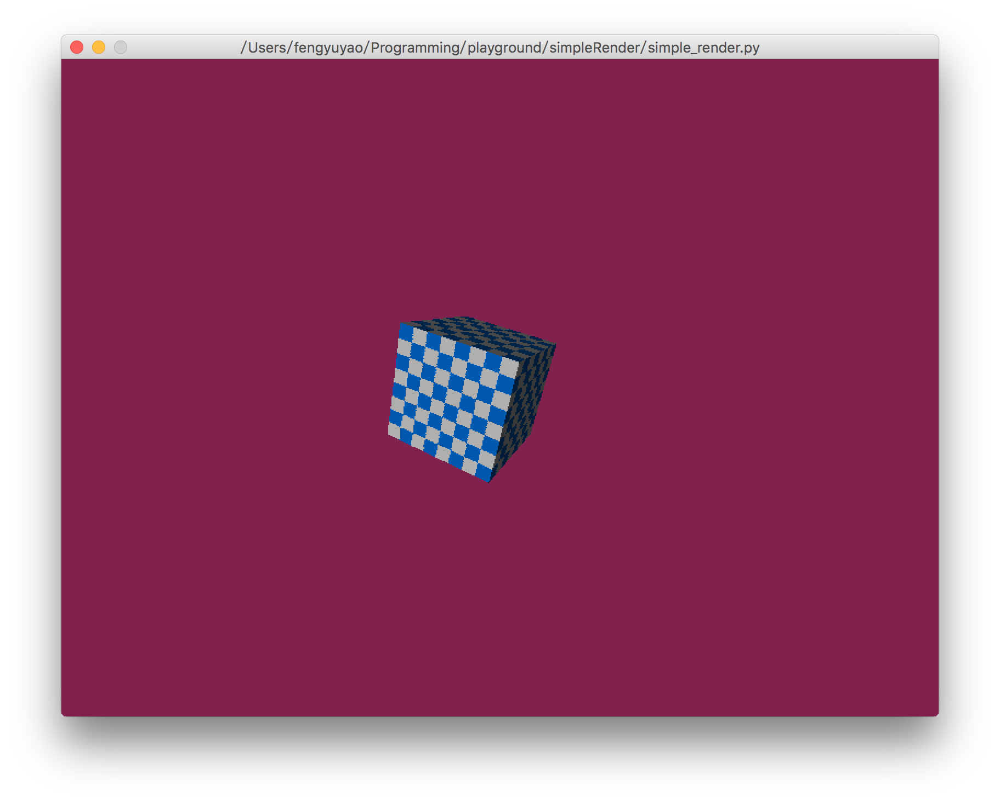

# Simple Render

## Introduction

This is a toy project for learning the theory of 3D render. I'm tring to
add every necessary step into only one file. For simplifying and performance, all math operation are implemented by numpy and the window management are implemented by pyglet.

## Features

1. World, view, projection transform
2. Simple texture mapping
3. Backface culling
4. Z-buffer
4. Diffuse direction lighting

## Screen shoot

## Dependencies

+ numpy for fast math computation
+ pyglet for window management

## Note

Because I have chosen Python as the main programming language. so there is a huge
performance issue.
